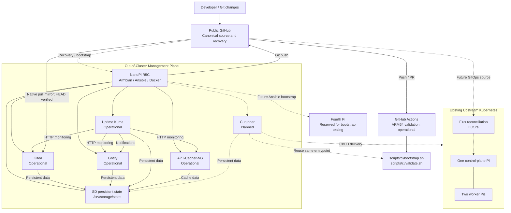

# ARM Homelab Platform

[](https://github.com/ctalaveraw/arm-homelab-platform/actions/workflows/platform-ci.yml)

**Status (2026-10-04):** Four management services operational; portable ARM64 GitHub CI passing; native GitHub-to-Gitea pull mirror verified. Kubernetes deployment via CI is not yet implemented.

Reproducible infrastructure and platform engineering
laboratory.

## Architecture

Management plane:
- NanoPi R5C
- Armbian
- Docker Engine and Compose v2 (Ansible-managed)
- Ansible-managed host baseline (implemented)

Compute plane:
- Existing upstream Kubernetes cluster
- kubeadm-based deployment
- Raspberry Pi hardware
- One control-plane node and two workers
- Fourth Pi reserved for bootstrap testing

## Objectives

1. Capture existing infrastructure.
2. Automate the management plane.
3. Establish external Git and CI/CD.
4. Codify Kubernetes configuration.
5. Demonstrate deployment and recovery.
6. Introduce GitOps and observability.

## Working principles

- Git is the configuration source of truth.
- Existing working infrastructure is preserved.
- Every sprint produces verifiable evidence.
- Architectural decisions are documented.
- Bootstrap must not depend on Gitea.

## Platform Architecture

This diagram represents architectural ownership and
dependency boundaries.

Solid connections are currently implemented.
Dashed connections represent planned integration.



### Current implementation

- Gitea 1.27.3 deployed through guarded systemd/Compose startup.
- Gotify 3.1.1 operational.
- Uptime Kuma 2.5.5 operational with Gotify alerting.
- APT-Cacher-NG operational with validated cache reuse and
  persistence across container recreation.

- R5C: Ansible-managed Armbian management host.
- Docker Engine and standalone Compose v2 installed.
- Required SD storage validated through Ansible preflight.
- Existing upstream kubeadm Kubernetes cluster operational.
- Public GitHub repository established as canonical recovery source.
- Gitea native **pull mirror** synchronized from public GitHub; observed matching `main` at `3e58f61`.
- GitHub-hosted ARM64 validation passing (first three runs, 2026-10-04); checks run through repository-owned CI scripts.

### Continuous integration

GitHub Actions is deliberately a thin adapter to [`scripts/ci/bootstrap.sh`](scripts/ci/bootstrap.sh) and [`scripts/ci/validate.sh`](scripts/ci/validate.sh). The validation entrypoint also runs directly on the R5C:

```bash
bash scripts/ci/validate.sh
```

On a fresh CI development machine, run `bash scripts/ci/bootstrap.sh` first (Python virtual environment; hosted CI also installs ShellCheck). Tests include Ansible syntax, Python/YAML parsing, Compose rendering with synthetic values, ShellCheck, and three static Compose safety-contract tests. These checks **do not** replace mount-guard integration tests, a host reboot test, or CI deployment testing. See the [CI runbook](docs/ci.md).

The local Gitea copy is a **pull mirror**, not the push destination or disaster-recovery source. A Gitea Actions runner has not yet been registered.

### Planned integrations

- Gitea Actions runner and OCI registry validation.
- CI/CD deployment into Kubernetes using Helm.
- Flux-based GitOps reconciliation.
- Automated fourth-Pi reconstruction.

### Current operational constraints

- USB archive storage is decommissioned pending hardware review.
- Docker's data root remains on eMMC.
- Persistent application state uses guarded SD-backed storage.
- Bootstrap must not depend exclusively on self-hosted Gitea.
- Local services currently use LAN HTTP; trusted HTTPS and TCP/3142 source ACL verification remain pending.
- Neither fresh-host reconstruction nor off-device application restore has been completed.

## Running the Management Baseline

From the repository root:

```bash
ansible-playbook --syntax-check ansible/playbooks/01-management.yml

ansible-playbook --check --diff -K ansible/playbooks/01-management.yml

ansible-playbook -K ansible/playbooks/01-management.yml
```

Prerequisites include Armbian, Git, Ansible, Python 3,
python3-apt, sudo access and the required SD filesystem.

The current implementation has been validated against
the existing R5C. Fresh-host reconstruction remains untested.

Service provisioning is implemented in playbooks 02 through 05.
Playbooks 02-04 install service units but do not yet declaratively
activate them; existing running services were manually enabled.
Playbook 05 declaratively enables and starts APT-Cacher-NG.
Local populated .env files are required and deliberately excluded
from the public repository.

## Project Documentation

- [Roadmap](docs/roadmap.md)
- [Engineering Backlog](docs/backlog.md)
- [Engineering Evidence](docs/interview/engineering-evidence.md)
- [Portable CI and mirroring runbook](docs/ci.md)
- [CI foundation sprint](docs/sprints/06-ci-foundation.md)
- [APT Cache Benchmark](docs/benchmarks/2026-10-04-apt-cacher-ng.md)
- [Controlled Incident](docs/incidents/2026-10-04-gitea-controlled-outage.md)
- [Architecture Decisions](docs/adr/)
- [Sprint Journal](docs/sprints/01-management-bootstrap.md)
