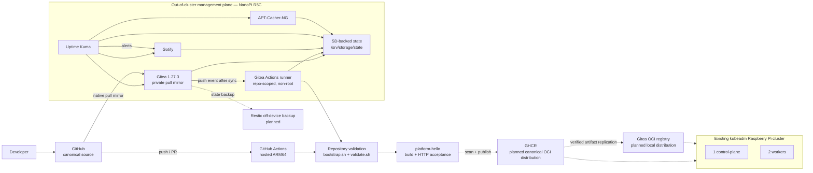

# ARM Homelab Platform

[](https://github.com/ctalaveraw/arm-homelab-platform/actions/workflows/platform-ci.yml)

**Status (2026-10-04):** The out-of-cluster ARM64 management plane is operational and configuration-managed. GitHub-hosted ARM64 CI validates the repository and builds/tests the first application image; a private Gitea pull mirror independently runs the same repository validation on a physical NanoPi R5C. Image scanning, OCI publication, registry replication, and Kubernetes delivery are the next gates.

This repository is a platform-engineering lab focused on reproducible infrastructure, application delivery, recovery, and operational evidence on ARM64 hardware.

## Current architecture

Solid arrows are implemented. Dashed arrows are planned.



See [docs/architecture/overview.md](docs/architecture/overview.md) for the implementation boundaries and planned delivery path.

## What is implemented

### Management plane

The NanoPi R5C runs Armbian/Debian Trixie and remains independent of the Kubernetes compute plane.

Ansible owns the host baseline plus guarded systemd/Compose lifecycles for:

- Gitea
- Gitea Actions runner
- Gotify
- Uptime Kuma
- APT-Cacher-NG

Stateful services use SD-backed persistent storage under `/srv/storage/state/services/<service>`. Startup guards verify the actual ext4 filesystem, reject unsafe path redirection, validate rendered Compose bindings, and fail closed instead of silently writing state to eMMC.

### Source and CI

- GitHub is the public canonical source and recovery copy.
- Gitea is a private one-way pull mirror.
- GitHub Actions runs repository validation on hosted ARM64 and then builds/tests `apps/platform-hello`.
- Gitea Actions runs repository validation on a physical ARM64 NanoPi R5C.
- Both environments reuse repository-owned scripts instead of duplicating validation logic in workflow YAML.
- The Gitea runner is repository-scoped, non-root, publishes no ports, drops Linux capabilities, and does not receive the production Docker socket.

### First application

`apps/platform-hello` is intentionally small so the delivery mechanics can be learned and defended:

- static HTML served by Python's standard-library HTTP server
- ARM64 container image
- UID/GID 10001 runtime
- local and GitHub-hosted HTTP readiness/content acceptance
- Dockerfile pre-build check through Buildx
- build job gated on repository validation

The image is not yet published to a registry and has not yet been deployed by CI to Kubernetes.

## Delivery objective

The next delivery path is:

```text
commit
  -> repository validation
  -> application Dockerfile check
  -> ARM64 image build
  -> runtime acceptance
  -> scan the same tested image
  -> publish immutable OCI artifact
  -> replicate to local Gitea OCI registry
  -> deploy to Kubernetes
  -> verify rollout
```

The design goal is to build once and promote the same tested artifact rather than rebuild independently between test, scan, publication, and deployment.

## Kubernetes compute plane

The target compute plane already exists:

- upstream kubeadm-based Kubernetes
- Raspberry Pi hardware
- one control-plane node
- two worker nodes
- fourth Pi reserved for bootstrap/reconstruction testing

The cluster currently has hand-configured workloads; CI-produced application delivery is intentionally still pending.

## Operational constraints

- USB archive storage is decommissioned pending hardware investigation.
- Docker's data root remains on eMMC.
- Application state is SD-backed and guarded at startup.
- Management services still use LAN HTTP; shared trusted HTTPS remains pending.
- TCP/3142 source ACL verification remains pending for APT-Cacher-NG.
- Fresh-host reconstruction is not yet fully proven.
- Off-device application backup/restore is not yet proven.
- Kubernetes does not yet consume an image produced by this repository's CI.

## Running repository validation

```bash
bash scripts/ci/bootstrap.sh
bash scripts/ci/validate.sh
```

Application acceptance:

```bash
bash scripts/ci/test-hello.sh
```

## Ansible playbooks

```text
00-preflight.yml
01-management.yml
02-gitea.yml
03-gitea-runner.yml
04-gotify.yml
05-uptime-kuma.yml
06-apt-cacher-ng.yml
```

Service playbooks install their systemd units, reload systemd when required, validate configuration, and declaratively enable/start the service.

## Documentation

- [Documentation index](docs/README.md)
- [Current architecture](docs/architecture/overview.md)
- [Roadmap](docs/roadmap.md)
- [Engineering backlog](docs/backlog.md)
- [CI and mirroring runbook](docs/ci.md)
- [Engineering evidence ledger](docs/interview/engineering-evidence.md)
- [PLAT-006 native Gitea CI sprint](docs/sprints/07-native-gitea-ci.md)
- [PLAT-007 application delivery sprint](docs/sprints/08-application-delivery-foundation.md)
- [Architecture decisions](docs/adr/)
- [Incident records](docs/incidents/)
- [Evidence screenshots](docs/evidence/)
