# ARM Homelab Platform

[](https://github.com/ctalaveraw/arm-homelab-platform/actions/workflows/platform-ci.yml)

**Status (2026-10-09):** The out-of-cluster ARM64 management plane is operational and configuration-managed. GitHub-hosted ARM64 CI builds, tests, scans and publishes one verified application artifact to GHCR, and the same immutable artifact is replicated to Gitea OCI. The CI-qualified digest runs in the Raspberry Pi kubeadm cluster and is now continuously reconciled from canonical Git by a hardened Flux installation using namespace-scoped application authority. Controlled rollout failure, rollback, GitOps drift correction, Git-driven desired-state changes, and reconciliation suspend/resume behavior have all been proven.

This repository is a platform-engineering lab focused on reproducible infrastructure, application delivery, recovery, and operational evidence on ARM64 hardware.

## Current architecture

Solid arrows are implemented. Dashed arrows are planned.

```mermaid
flowchart LR
    DEV["Developer / operator"]
    GH["GitHub<br/>canonical source"]
    GHCI["GitHub Actions<br/>hosted ARM64"]
    VALIDATE["Repository validation<br/>ShellCheck + Ruff + yamllint + actionlint<br/>Ansible + Compose contracts"]
    BUILD["platform-hello<br/>build once"]
    TEST["Runtime acceptance<br/>ARM64 + UID 10001 + HTTP"]
    SCAN["Trivy<br/>vuln + secret scan"]
    XFER["Verified job handoff<br/>archive checksum + image ID"]
    PUB["Publisher job<br/>packages: write only"]
    GHCR["GHCR<br/>canonical OCI distribution"]

    subgraph MGMT["Out-of-cluster management plane — NanoPi R5C"]
        GITEA["Gitea 1.27.3<br/>private pull mirror"]
        RUNNER["Gitea Actions runner<br/>repo-scoped, non-root"]
        GOTIFY["Gotify"]
        KUMA["Uptime Kuma"]
        ACNG["APT-Cacher-NG"]
        SD["SD-backed state<br/>/srv/storage/state"]
        GITEA --> SD
        RUNNER --> SD
        GOTIFY --> SD
        KUMA --> SD
        ACNG --> SD
        KUMA --> GITEA
        KUMA --> GOTIFY
        KUMA --> ACNG
        KUMA -->|"alerts"| GOTIFY
    end

    subgraph COMPUTE["Existing kubeadm Raspberry Pi cluster"]
        CP["1 control-plane"]
        WK["2 workers"]
    end

    GREG["Gitea OCI registry<br/>local distribution"]
    FLUX["Flux<br/>source + kustomize controllers"]
    BACKUP["Restic off-device backup<br/>planned"]

    DEV --> GH
    GH -->|"push / PR"| GHCI
    GHCI --> VALIDATE
    VALIDATE --> BUILD
    BUILD --> TEST
    TEST --> SCAN
    SCAN --> XFER
    XFER --> PUB
    PUB --> GHCR

    GH -->|"native pull mirror"| GITEA
    GITEA -->|"push event after sync"| RUNNER
    RUNNER --> VALIDATE

    GHCR -->|"verified artifact replication"| GREG
    GHCR -->|"digest pull"| COMPUTE
    GH -->|"desired-state pull"| FLUX
    FLUX -->|"scoped reconcile"| COMPUTE
    GREG -.->|"future local Kubernetes pull"| COMPUTE
    GITEA -.->|"state backup"| BACKUP
```



See [docs/architecture/overview.md](docs/architecture/overview.md) for the implementation boundaries and planned delivery path.

## What is implemented

### Management plane

The NanoPi R5C runs Armbian/Debian Trixie and remains independent of the Kubernetes compute plane.

Ansible owns the host baseline plus guarded systemd/Compose lifecycles for:

- Gitea
- Gitea Actions runner
- Gotify
- Uptime Kuma
- APT-Cacher-NG

Stateful services use SD-backed persistent storage under `/srv/storage/state/services/<service>`. Startup guards verify the actual ext4 filesystem, reject unsafe path redirection, validate rendered Compose bindings, and fail closed instead of silently writing state to eMMC.

### Source and CI

- GitHub is the public canonical source and recovery copy.
- `main` is protected and changes flow through pull requests plus CI.
- Gitea is a private one-way pull mirror, not a second push target.
- The R5C working copy keeps Gitea as a fetch-only remote and can prove GitHub/Gitea/local-main convergence with `scripts/ops/check-source-parity.sh`.
- GitHub Actions runs repository validation and the application build/test/scan/publish path on hosted ARM64.
- Gitea Actions runs repository validation on a physical ARM64 NanoPi R5C.
- Repository-owned scripts carry validation and image-transfer mechanics so workflow YAML stays focused on orchestration and permission boundaries.
- The Gitea runner is repository-scoped, non-root, publishes no ports, drops Linux capabilities, and does not receive the production Docker socket.

### First application and OCI publication

`apps/platform-hello` is intentionally small so the delivery mechanics can be learned and defended.

The implemented path is:

```text
source commit
  -> repository validation
  -> Dockerfile check
  -> build one linux/arm64 image
  -> runtime acceptance on that exact image
  -> Trivy vulnerability + secret scan
  -> export image + record Docker image ID
  -> upload/download across a separate GitHub job
  -> verify archive checksum
  -> verify loaded Docker image ID matches
  -> authenticate from a publisher with packages: write
  -> publish the same verified image to GHCR
```

The first successful publication was produced by GitHub Actions run #27 from commit:

```text
1ddd76c14a35f974d06dbd1ed7e3c4c14475c92d
```

Published tag:

```text
ghcr.io/ctalaveraw/platform-hello:1ddd76c14a35f974d06dbd1ed7e3c4c14475c92d
```

Registry digest:

```text
sha256:f3c542d3bbc8599f83019263899c2396f6f7aadbda781f329d5a0fa17afaa61e
```

The commit-derived tag provides traceability; the registry digest is the immutable OCI identity intended for later deployment.

## Delivery objective

The implemented distribution path is:

```text
verified GHCR artifact
  -> independently retrieve by immutable digest
  -> replicate the same OCI artifact into Gitea
  -> preserve registry manifest digest
  -> independently retrieve from Gitea by digest
  -> associate the Gitea package with the mirrored source repository
```

The Kubernetes delivery path is now implemented:

```text
known immutable registry digest
  -> Kubernetes Deployment
  -> container runtime pull
  -> Ready Pod
  -> verify running image identity
  -> ClusterIP Service + EndpointSlice
  -> in-cluster HTTP verification
  -> scoped Flux pull reconciliation from canonical Git
```

The design goal remains build once, then promote and deploy the same tested/scanned artifact instead of rebuilding independently between stages.

## Kubernetes compute plane

The target compute plane already exists:

- upstream kubeadm-based Kubernetes
- Raspberry Pi hardware
- one control-plane node
- two worker nodes
- fourth Pi reserved for bootstrap/reconstruction testing

The cluster still contains earlier hand-configured workloads, but `platform-hello` is now repository-defined and deployed from the verified OCI delivery path.

## Operational constraints

- USB archive storage is decommissioned pending hardware investigation.
- Docker's data root remains on eMMC.
- Application state is SD-backed and guarded at startup.
- Management services still use LAN HTTP; shared trusted HTTPS remains pending.
- TCP/3142 source ACL verification remains pending for APT-Cacher-NG.
- Fresh-host reconstruction is not yet fully proven.
- Off-device application backup/restore is not yet proven.
- Automated GitOps/runtime observability and alerting remain pending.

## Running repository validation

```bash
bash scripts/ci/bootstrap.sh
bash scripts/ci/validate.sh
```

Local application build and acceptance:

```bash
IMAGE=platform-hello:local
bash scripts/ci/build-hello.sh "$IMAGE"
bash scripts/ci/test-hello.sh "$IMAGE"
```

## Ansible playbooks

```text
00-preflight.yml
01-management.yml
02-gitea.yml
03-gitea-runner.yml
04-gotify.yml
05-uptime-kuma.yml
06-apt-cacher-ng.yml
```

The management baseline also includes the `kubernetes_client` and `flux_client` roles, which install and verify pinned ARM64 Kubernetes and Flux clients used by the R5C.

Service playbooks install their systemd units, reload systemd when required, validate configuration, and declaratively enable/start the service.

## Documentation

- [Documentation index](docs/README.md)
- [Current architecture](docs/architecture/overview.md)
- [Roadmap](docs/roadmap.md)
- [Engineering backlog](docs/backlog.md)
- [CI, mirroring and OCI publication](docs/ci.md)
- [Engineering evidence ledger](docs/interview/engineering-evidence.md)
- [PLAT-006 native Gitea CI sprint](docs/sprints/07-native-gitea-ci.md)
- [PLAT-007 application delivery sprint](docs/sprints/08-application-delivery-foundation.md)
- [PLAT-008 dual OCI distribution sprint](docs/sprints/09-dual-oci-distribution.md)
- [PLAT-009 Kubernetes delivery sprint](docs/sprints/10-kubernetes-delivery.md)
- [PLAT-010 failure and rollback sprint](docs/sprints/11-deployment-failure-rollback.md)
- [PLAT-011 Flux GitOps sprint](docs/sprints/12-flux-gitops.md)
- [ADR-0007 — Digest-pinned Kubernetes image pulls](docs/adr/0007-digest-pinned-kubernetes-image-pulls.md)
- [ADR-0008 — External Kubernetes deployer identity](docs/adr/0008-external-kubernetes-deployer-identity.md)
- [ADR-0009 — Flux GitOps trust boundary](docs/adr/0009-flux-gitops-trust-boundary.md)
- [ADR-0006 — Build-once OCI promotion](docs/adr/0006-build-once-oci-promotion.md)
- [Architecture decisions](docs/adr/)
- [Incident records](docs/incidents/)
- [Evidence screenshots](docs/evidence/)
