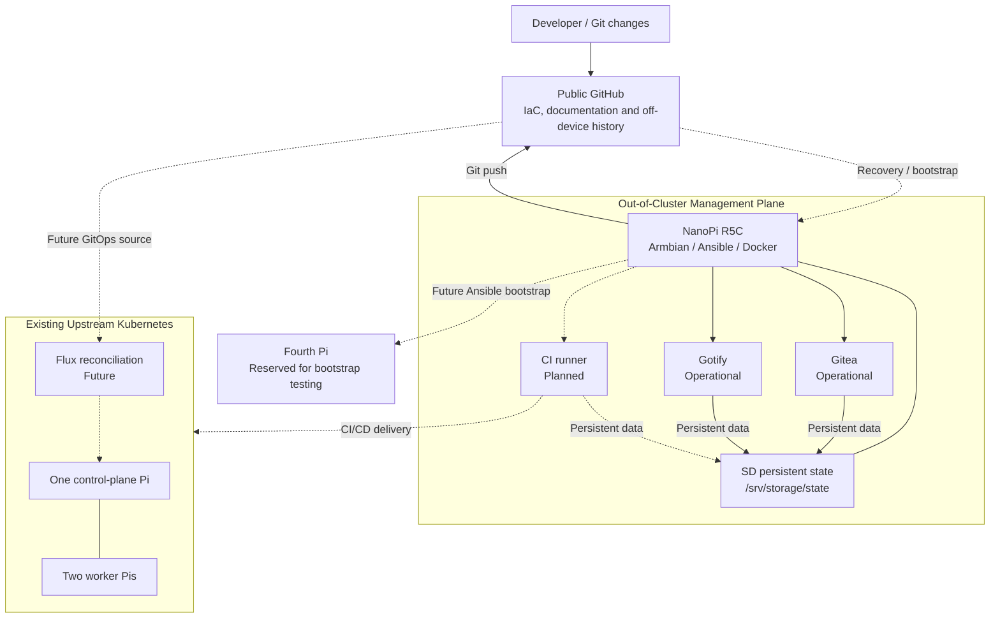

# Homelab Platform

Reproducible infrastructure and platform engineering
laboratory.

## Architecture

Management plane:
- NanoPi R5C
- Armbian
- Docker Engine and Compose v2 (Ansible-managed)
- Ansible-managed host baseline (implemented)

Compute plane:
- Existing upstream Kubernetes cluster
- kubeadm-based deployment
- Raspberry Pi hardware
- One control-plane node and two workers
- Fourth Pi reserved for bootstrap testing

## Objectives

1. Capture existing infrastructure.
2. Automate the management plane.
3. Establish external Git and CI/CD.
4. Codify Kubernetes configuration.
5. Demonstrate deployment and recovery.
6. Introduce GitOps and observability.

## Working principles

- Git is the configuration source of truth.
- Existing working infrastructure is preserved.
- Every sprint produces verifiable evidence.
- Architectural decisions are documented.
- Bootstrap must not depend on Gitea.

## Platform Architecture

This diagram represents architectural ownership and
dependency boundaries.

Solid connections are currently implemented.
Dashed connections represent planned integration.



### Current implementation

- Gitea 1.27.3 deployed through guarded systemd/Compose startup.
- Gotify 3.1.1 operational.

- R5C: Ansible-managed Armbian management host.
- Docker Engine and standalone Compose v2 installed.
- Required SD storage validated through Ansible preflight.
- Existing upstream kubeadm Kubernetes cluster operational.
- External GitHub repository established.

### Planned integrations

- Gitea Actions runner and OCI registry validation.
- CI/CD deployment into Kubernetes using Helm.
- Flux-based GitOps reconciliation.
- Automated fourth-Pi reconstruction.

### Current operational constraints

- USB archive storage is decommissioned pending hardware review.
- Docker's data root remains on eMMC.
- Persistent application state will use explicitly guarded storage.
- Bootstrap must not depend exclusively on self-hosted Gitea.

## Running the Current Automation

From the repository root:

```bash
ansible-playbook --syntax-check ansible/playbooks/01-management.yml

ansible-playbook --check --diff -K ansible/playbooks/01-management.yml

ansible-playbook -K ansible/playbooks/01-management.yml
```

Prerequisites include Armbian, Git, Ansible, Python 3,
python3-apt, sudo access and the required SD filesystem.

The current implementation has been validated against
the existing R5C. Fresh-host reconstruction remains untested.

## Project Documentation

- [Roadmap](docs/roadmap.md)
- [Engineering Backlog](docs/backlog.md)
- [Engineering Evidence](docs/interview/engineering-evidence.md)
- [Architecture Decisions](docs/adr/)
- [Sprint Journal](docs/sprints/01-management-bootstrap.md)
