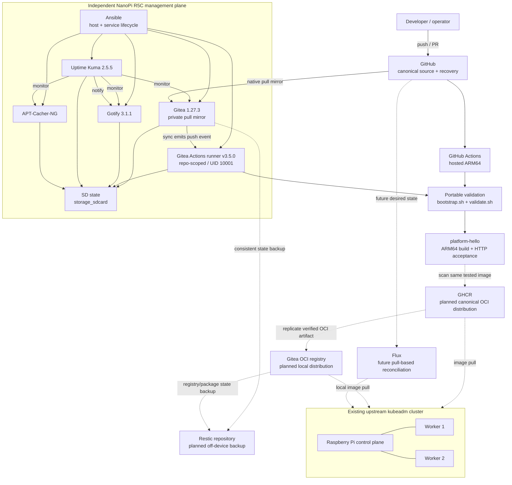

# Platform Architecture Overview

**Updated:** 2026-10-04  
**Scope:** Current convergence point after native Gitea CI and the first GitHub-hosted application build.

## Design intent

The platform separates the **management plane** from the existing Kubernetes **compute plane**. GitHub remains an external recovery/source-of-truth dependency so management-plane reconstruction does not require the self-hosted Gitea instance.

The delivery system is deliberately incremental: repository validation is operational in two CI environments; application build/runtime acceptance is operational in GitHub Actions; artifact publication and Kubernetes delivery are the next boundaries.

## Current and planned architecture

Solid arrows are implemented. Dashed arrows are planned.



## Implemented boundaries

### Source ownership

GitHub is the canonical public repository. Gitea is a private pull mirror, not a second authoritative push target.

### CI execution

GitHub Actions:

- hosted ARM64 runner;
- repository validation;
- Dockerfile Buildx check;
- dependent ARM64 Hello World build and HTTP acceptance.

Gitea Actions:

- repository-scoped physical ARM64 runner on the R5C;
- same repository validation entrypoints;
- no production Docker socket;
- no deployment, registry, or Kubernetes credentials.

### Management service lifecycle

Ansible owns installation of the systemd unit, daemon reload, configuration validation, enablement, and initial startup for all five management services.

Stateful workloads use explicit SD-backed bind mounts with `create_host_path: false` and service-specific startup guards.

## Planned artifact path

The intended supply-chain path is:

```text
source commit
  -> validation
  -> build once
  -> runtime acceptance
  -> vulnerability scan
  -> publish same tested OCI artifact to GHCR
  -> record immutable digest
  -> replicate that artifact to Gitea OCI
  -> pull by digest from Kubernetes
```

Rebuilding independently after testing is intentionally avoided because it breaks artifact identity and creates another drift/failure surface.

## Recovery path

Planned recovery has two independent ideas:

1. **Distribution redundancy:** GHCR and Gitea OCI provide separate places from which a verified image can be retrieved.
2. **Backup/restore:** Restic will protect persistent Gitea/package state off-device.

A second registry is not a substitute for backup, and backup is not a live registry failover mechanism.

## Remaining architecture gaps

- shared trusted HTTPS for management endpoints;
- registry publication and replication;
- off-device Restic backup/restore validation;
- Kubernetes delivery of a CI-produced image;
- deployment rollback exercise;
- full fresh-host rebuild;
- eventual Flux migration from push-based deployment to pull-based reconciliation.
