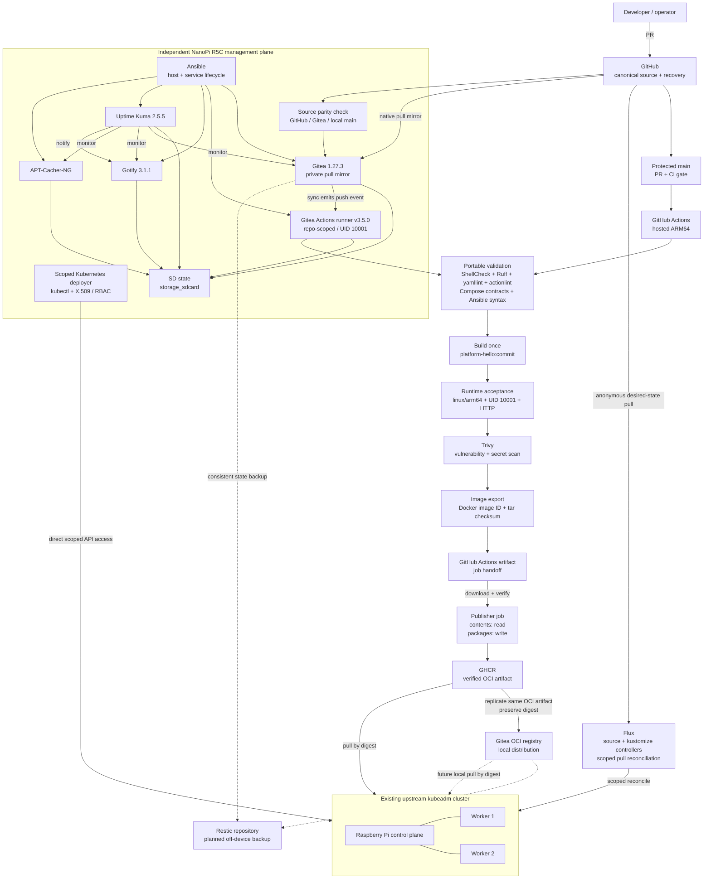

# Platform Architecture Overview

**Updated:** 2026-10-09
**Scope:** Current convergence point after PLAT-011 hardened Flux GitOps reconciliation validation.

## Design intent

The platform separates the **management plane** from the existing Kubernetes **compute plane**. GitHub remains an external recovery/source-of-truth dependency so management-plane reconstruction does not require the self-hosted Gitea instance.

Source, validation, artifact production, artifact promotion, and runtime deployment are intentionally treated as separate trust boundaries.

## Current and planned architecture

Solid arrows are implemented. Dashed arrows are planned.



## Implemented boundaries

### Source ownership and convergence

GitHub is the canonical public repository. Gitea is a private pull mirror, not a second authoritative push target.

The controller working copy keeps:

- GitHub as its normal push destination;
- Gitea as a fetch-only remote;
- `scripts/ops/check-source-parity.sh` to compare local `main`, GitHub `main`, and mirrored Gitea `main`.

Source parity was proven at commit `e9eb8e245428dec8c91656df94f444bca88231a9` before the GHCR publication work continued.

GitHub `main` is protected so merge policy is enforced by the platform rather than operator memory alone.

### CI execution and validation

GitHub Actions:

- hosted ARM64 runner;
- repository validation;
- Dockerfile Buildx check;
- one ARM64 application build;
- runtime acceptance against that exact image;
- Trivy vulnerability and secret scanning;
- verified artifact export;
- separate least-privileged publisher job.

Repository validation currently covers:

- Bash syntax;
- ShellCheck;
- Python syntax parsing;
- Ruff;
- YAML parsing;
- yamllint using repository-owned policy;
- actionlint for GitHub Actions;
- four Compose safety-contract tests;
- Ansible playbook syntax;
- rendered Compose configuration.

Gitea Actions:

- repository-scoped physical ARM64 runner on the R5C;
- same repository-owned validation entrypoints;
- no production Docker socket;
- no deployment, registry, or Kubernetes credentials.

### Build-once artifact promotion

The application image is built once in the read-only build job.

The same image is then:

1. runtime-tested;
2. scanned;
3. exported with its Docker image ID recorded;
4. transferred as a GitHub Actions artifact;
5. protected by an archive SHA-256 checksum;
6. loaded on a separate publisher runner;
7. checked against the original Docker image ID;
8. pushed to GHCR by a job with `packages: write`.

The publisher does not rebuild the image.

The first successful publication came from commit:

```text
1ddd76c14a35f974d06dbd1ed7e3c4c14475c92d
```

Docker image ID preserved across the job boundary:

```text
sha256:6778f34a5be85bfd970f9124f53efb761d12317feb15c0a4f5c2b29117a0416b
```

GHCR manifest digest:

```text
sha256:f3c542d3bbc8599f83019263899c2396f6f7aadbda781f329d5a0fa17afaa61e
```

The Docker image ID and registry manifest digest are intentionally different identities for different objects.

### Dual OCI distribution

The R5C uses Ansible-managed Skopeo for registry-native artifact operations.

Repository-owned operational tooling provides:

- `scripts/ops/replicate-oci-image.sh` — copies an existing OCI artifact between registries with digest preservation and performs no rebuild;
- `scripts/ops/verify-oci-parity.sh` — compares source and destination registry manifest digests;
- `scripts/ops/verify-oci-retrieval.sh` — proves complete artifact retrieval into a fresh temporary OCI layout;
- `scripts/ops/link-gitea-package.sh` — manages the Gitea-specific package/repository association independently of OCI artifact contents.

The qualified `platform-hello` artifact is independently retrievable from both GHCR and Gitea by digest.

Both registries report:

```text
sha256:f3c542d3bbc8599f83019263899c2396f6f7aadbda781f329d5a0fa17afaa61e
```

for the promoted registry manifest.

The Gitea package is associated with the mirrored `admin/arm-homelab-platform` repository.

This provides distribution redundancy but is not a substitute for off-device backup or build provenance.

### Management service lifecycle

Ansible owns installation of the systemd unit, daemon reload, configuration validation, enablement, and initial startup for all five management services.

Stateful workloads use explicit SD-backed bind mounts with `create_host_path: false` and service-specific startup guards.

## Current artifact path

Implemented:

```text
source commit
  -> validation
  -> build once
  -> runtime acceptance
  -> Trivy scan
  -> transfer with checksum + image-ID verification
  -> publish same verified artifact to GHCR
  -> record registry digest
  -> independently retrieve GHCR artifact by digest
  -> replicate same OCI artifact to Gitea with digest preservation
  -> verify GHCR/Gitea manifest parity
  -> independently retrieve Gitea artifact by digest
  -> associate Gitea package with mirrored source repository
```

Kubernetes delivery is now implemented:

```text
known immutable registry digest
  -> Kubernetes Deployment
  -> worker registry retrieval
  -> Ready Pod
  -> verify running image identity
  -> ClusterIP Service + EndpointSlice
  -> in-cluster HTTP verification
  -> direct scoped R5C reconciliation
```

Normal application reconciliation is now pull-based through Flux using
the dedicated `platform-hello-reconciler` ServiceAccount in `flux-system`,
bound only to application permissions in `platform-demo`.

The namespace-scoped X.509 `platform-deployer` identity remains an independent
break-glass and verification path rather than the routine deployment mechanism.

Rebuilding independently after testing is intentionally avoided because it breaks artifact identity and creates another drift/failure surface.

## Recovery path

Recovery has two independent ideas:

1. **Distribution redundancy:** GHCR and the local Gitea OCI registry provide separate places from which the same verified image can be retrieved.
2. **Backup/restore:** Restic will protect persistent Gitea/package state off-device.

A second registry is not a substitute for backup, and backup is not a live registry failover mechanism.

## Remaining architecture gaps

- shared trusted HTTPS for management endpoints;
- off-device Restic backup/restore validation;
- full fresh-host rebuild;
- automated observability and alerting for GitOps reconciliation failures.
