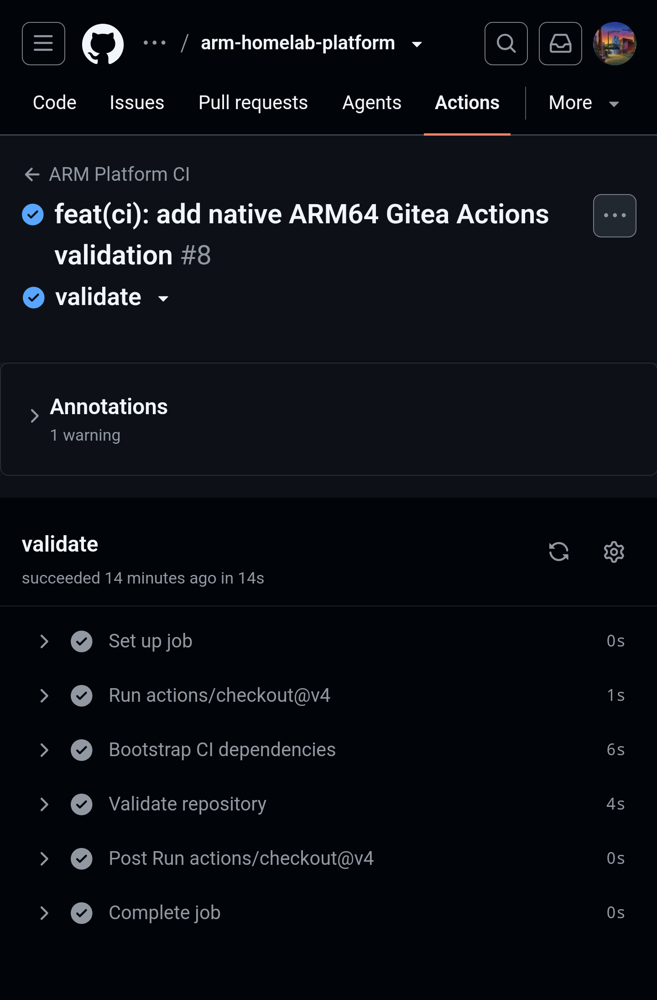
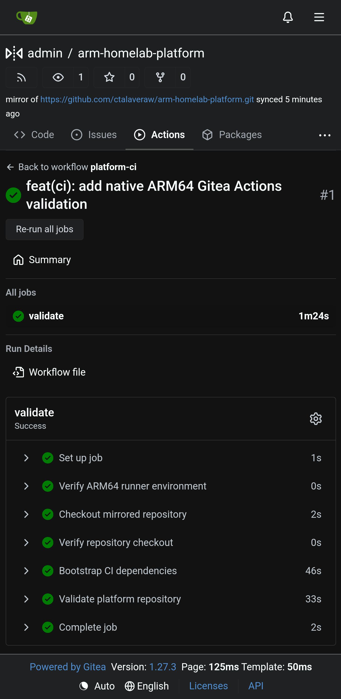
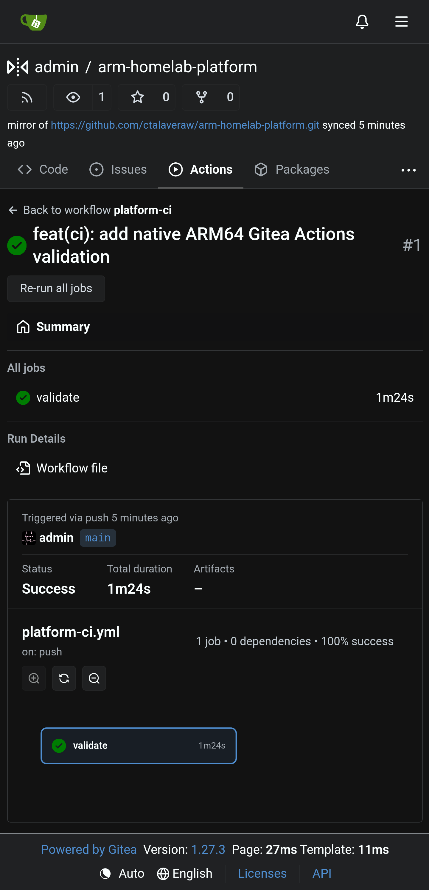

# Sprint 07 — Native Gitea Actions CI

**Work item:** PLAT-006  
**Date completed:** 2026-10-04  
**Status:** Complete — functional acceptance and evidence archived  
**Platform:** NanoPi R5C · ARM64 · Armbian / Debian Trixie

## Objective

Establish a self-hosted ARM64 CI execution environment using Gitea Actions while retaining GitHub as the canonical source repository.

Both CI platforms must execute the existing repository-owned validation scripts without duplicating validation logic or granting the self-hosted runner unrestricted access to the production Docker daemon.

### Target delivery path

```text
Canonical GitHub repository
        |
        | Git push
        v
Private Gitea pull mirror
        |
        | Mirror synchronization / push event
        v
Gitea Actions
        |
        | Repository-scoped job assignment
        v
NanoPi R5C ARM64 runner
        |
        +-- scripts/ci/bootstrap.sh
        |
        +-- scripts/ci/validate.sh
        |
        v
Validated repository
```

## Implementation

### 1. Declarative service ownership

Closed the remaining automation gap in the management-service playbooks.

Ansible now owns the installation, systemd daemon reload, configuration validation, boot enablement and initial activation of all five management services:

| Playbook | Managed service |
|---|---|
| `02-gitea.yml` | Gitea |
| `03-gitea-runner.yml` | Gitea Actions Runner |
| `04-gotify.yml` | Gotify |
| `05-uptime-kuma.yml` | Uptime Kuma |
| `06-apt-cacher-ng.yml` | APT-Cacher-NG |

Service units are stored in Git and installed into `/etc/systemd/system/`.

The runner playbook was executed twice to verify convergence. The first execution reported `changed=3`; the second reported `changed=0`, with zero failures.

### 2. ARM64 runner image

Created a purpose-built image at:

`images/gitea-runner/Dockerfile`

The image extends `docker.io/gitea/runner:3` and provisions the validation toolchain, including Python, Node.js, Git, Bash, ShellCheck and Docker Compose CLI.

Implemented a dedicated non-root execution identity:

- UID/GID: `10001:10001`
- Writable HOME: `/home/ci`
- Persistent runner identity: `/data`
- Execution mode: host-mode jobs inside the runner container

The upstream runner image declares `/data` as a volume. An initial integration test exposed a runtime ownership mismatch that prevented pip and Ansible from writing their temporary files.

Separating the writable user HOME from persistent runner identity resolved this failure.

The CI dependency pin was updated to `ansible-core==2.21.4` for compatibility with the runner's Python 3.14 environment.

A complete disposable-container integration test subsequently passed.

### 3. Persistent runner lifecycle

Provisioned persistent state at:

`/srv/storage/state/services/gitea-runner`

Storage protections include:

- Verification of the expected `storage_sdcard` ext4 filesystem.
- Explicit Compose bind source.
- `create_host_path: false`.
- Directory ownership `10001:10001`, mode `0700`.
- Registered `.runner` identity ownership `10001:10001`, mode `0600`.
- Rejection of missing or redirected storage paths.
- systemd startup guarded by `/usr/local/sbin/gitea-runner-check-storage`.

The runner was registered at repository scope using the dedicated label:

`r5c-arm64-validation:host`

Runner registration succeeded using Gitea runner v3.5.0.

Ansible deployed and enabled `gitea-runner.service`. The runner container remained operational and successfully declared itself to the Gitea server.

### 4. Native workflow integration

Created:

`.gitea/workflows/platform-ci.yml`

The Gitea workflow targets the self-hosted ARM64 runner and invokes the same validation entrypoints used by GitHub Actions:

```bash
bash scripts/ci/bootstrap.sh
bash scripts/ci/validate.sh
```

The existing GitHub workflow remains under:

`.github/workflows/platform-ci.yml`

Platform-specific workflow definitions are deliberately thin. Validation logic remains centralized in reusable repository scripts.

### 5. Regression coverage

Expanded the Compose safety-contract suite from three to four tests.

The suite validates:

1. Docker restart policies cannot bypass systemd-managed startup.
2. Stateful services use explicit persistent bind mounts.
3. Network-facing applications require explicit host bind addresses; the runner publishes no ports.
4. The runner operates without privileged mode, additional Linux capabilities or a mounted production Docker socket.

All four tests passed.

## Acceptance evidence

### GitHub Actions

**Workflow:** ARM Platform CI  
**Run:** #8  
**Result:** Success  
**Duration:** 14 seconds

The GitHub-hosted ARM64 runner successfully executed the portable repository validation workflow.

A non-blocking checkout runtime warning was observed at the time of this run. It was later resolved on GitHub-hosted jobs by upgrading `actions/checkout` to v5.

### Gitea Actions

**Repository:** `admin/arm-homelab-platform`  
**Workflow:** ARM Platform CI - Gitea  
**Run:** #1  
**Runner:** `r5c-arm64-validation-01`  
**Result:** Success  
**Duration:** 1 minute 24 seconds

Confirmed successful execution of:

- ARM64 runner environment verification.
- Mirrored repository checkout.
- Repository checkout verification.
- CI dependency bootstrap.
- Complete platform validation.

The Gitea run details explicitly identified its trigger as `push` on `main`.

The workflow was dispatched following a forced synchronization of the GitHub pull mirror. This proves that mirror synchronization successfully generated a push-triggered Actions run on the deployed Gitea 1.27.3 instance.


### Evidence files

#### GitHub Actions — Successful ARM64 validation

Run #8 completed successfully in 14 seconds.



#### Gitea Actions — Native ARM64 runner

Run #1 completed successfully in 1 minute 24 seconds.



#### Mirror synchronization — Push event confirmation

Forced mirror synchronization generated a `push` event on `main`, triggering the native Gitea Actions workflow.



## Security and architectural decisions

The first self-hosted runner is intentionally a trusted validation worker rather than a general-purpose, multi-tenant execution platform.

Controls implemented:

- Repository-scoped registration.
- Non-root container execution.
- No privileged container execution.
- All Linux capabilities dropped.
- `no-new-privileges` enabled.
- No production Docker socket mounted.
- No published runner ports.
- Persistent registration identity excluded from Git.
- No deployment, registry or Kubernetes credentials assigned.

Host-mode workflow steps execute inside the runner container and share its environment. This does not provide adequate isolation for arbitrary untrusted pull requests.

Runner access must remain restricted to trusted repository workloads until stronger job isolation is introduced.

## Known limitations and deferred work

- Runner image currently uses a locally built `:dev` tag; reproducible image publication and controlled image rollout remain pending.
- Automatic restart/redeployment on Compose definition changes is not yet implemented.
- Ansible validates the locally available runner image but does not yet build or distribute it.
- Complete blank-host bootstrap still requires SD preparation, local configuration and runner registration.
- Off-device backup and restoration of persistent management-service state remain outstanding.
- Unattended scheduled mirror-trigger behavior requires separate verification.
- GitHub-hosted checkout warnings were subsequently resolved; Gitea remains on checkout v4 until compatibility is explicitly tested.


## Outcome

PLAT-006 established two successful ARM64 CI execution environments using one portable validation implementation:

1. GitHub-hosted ARM64 Actions.
2. Self-hosted Gitea Actions on physical NanoPi R5C hardware.

The management plane can now receive canonical repository changes through its private Git mirror and execute validation locally.

**Functional acceptance: PASSED.**

## Next sprint — PLAT-007

Application delivery foundation.

The first application now lives under `apps/platform-hello`. GitHub Actions validates the repository, performs a Dockerfile Buildx check, and then builds/runs HTTP acceptance on hosted ARM64.

Remaining PLAT-007 gates are to carry one image identity through test, scan, publication, immutable digest capture and independent retrieval before Kubernetes deployment.

See [Sprint 08](08-application-delivery-foundation.md).
